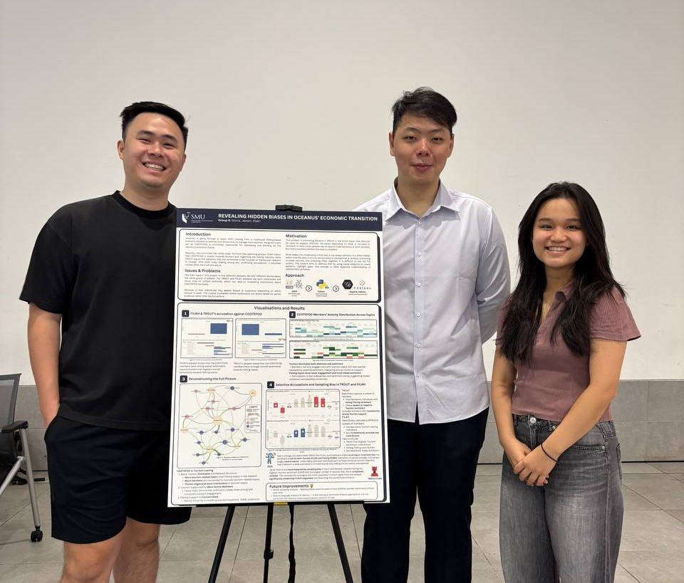

::: page-intro
We are a team of Singapore Management University students from the IS428 Visual Analytics course. This project brought together our shared interests in data storytelling, visual design, and analytical problem-solving.

Through this challenge, we worked collaboratively across data preparation, analysis, visualisation, and website development to uncover how selective evidence can shape competing narratives.
:::

## Meet the Team

{.team-photo width="961"}

:::::: card-grid
::: profile-card
### Elsen Soh

Year 4

*Quantitative Economics, Data Science & Analytics*
:::

::: profile-card
### Jaxsen Tee

Year 3

*Information Systems (Business Analytics) &\
Business Management (Quantitative Finance)*
:::

::: profile-card
### Gloria Phua

Year 3

*Information Systems (Business Analytics)*
:::
::::::

## Our Project Experience

This project was a valuable opportunity for us to apply visual analytics concepts to a realistic and open-ended challenge. Beyond technical analysis, it taught us the importance of teamwork, critical thinking, and designing clear stories from incomplete data.
