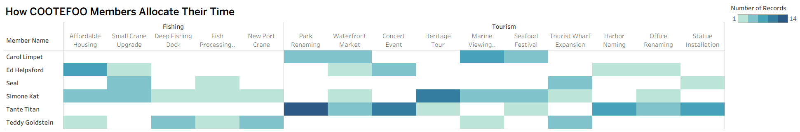
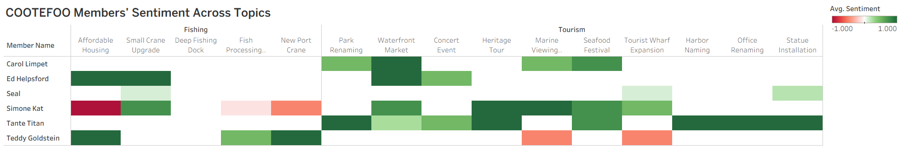
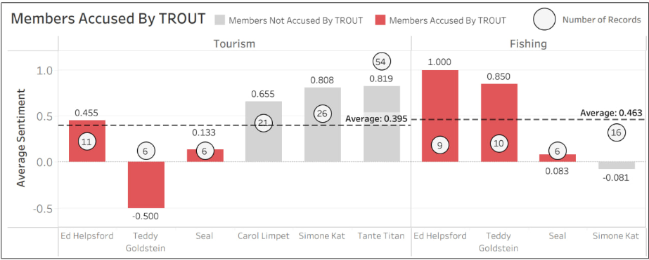
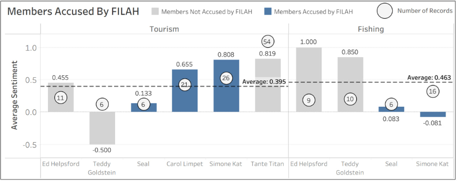

::: page-intro
This page presents the four main findings from our analysis of FILAH, TROUT, and the journalist dataset. Together, these results show how partial evidence can support conflicting accusations, and how broader context changes the interpretation of COOTEFOO’s behaviour.

Each section below highlights a different layer of the story, from accusation-based sentiment patterns to broader activity distribution, network reconstruction, and member-level sampling bias.
:::

## FILAH & TROUT’s accusations against COOTEFOO

Our first analysis examines whether the accusations made by FILAH and TROUT are supported by the records contained within their own datasets. This addresses the first MC2 task: assessing whether signs of bias are visible in each group’s selective evidence.

::::: card-grid
::: info-card
### FILAH's Accusations

{width="100%"}

FILAH’s dataset suggests that COOTEFOO members show stronger overall positive sentiment toward tourism-related topics, while fishing-related topics appear weaker or more negatively viewed.
:::

::: info-card
### TROUT's Accusations

{width="100%"}

TROUT’s dataset presents the opposite pattern, where members appear more supportive of fishing-related topics than tourism-related activities.
:::
:::::

Taken separately, both datasets seem to support their respective accusations. However, this also reveals an important limitation: each narrative is shaped by the subset of records each group was able to capture. Rather than conclusively proving bias, these visuals show how selective evidence can produce two persuasive but opposing stories.

::: takeaway-box
**Key Takeaway**

Both FILAH and TROUT’s datasets appear to support their own claims, but only within the boundaries of the evidence they selectively contain.
:::

## COOTEFOO Members’ Activity Distribution Across Topics

Our second analysis looks at how COOTEFOO members distribute both their attention and sentiment across fishing- and tourism-related topics. This helps us move beyond accusation-based narratives and instead examine how the committee behaves more broadly when activity patterns are viewed in combination.

::: info-card
{width="100%"}

{width="100%"}

The first heatmap shows how COOTEFOO members allocate their time across different topics, while the second heatmap shows the sentiment they express toward those same topics.

Taken together, the two visuals suggest that tourism-related topics occupy a larger share of members’ attention and are also associated with more consistently positive sentiment. In contrast, fishing-related topics appear less evenly distributed across members and show a more mixed range of sentiment, suggesting weaker consensus and more variation in support.

This result adds an important layer to the earlier accusation analysis. Rather than relying only on the selective records presented by FILAH and TROUT, these broader topic-level patterns suggest that tourism is more dominant not only in where members spend their time, but also in how positively those topics are engaged with.
:::

::: takeaway-box
**Key Takeaway**

Tourism-related topics appear to dominate both member attention and sentiment, while fishing-related topics show lower engagement and more varied sentiment.
:::

## Reconstructing the Full Picture

Our third analysis brings together the broader combined dataset to reconstruct a fuller picture of COOTEFOO’s behaviour. Unlike the earlier accusation-based visuals, this network graph captures how members, topics, and interactions connect when viewed in wider context.

::: {.info-card .result-feature}
{width="100%"}

The combined knowledge graph suggests that COOTEFOO is more tourism-leaning overall. Tourism-related topics appear more prominent in the network, with more members connected across multiple tourism activities and visibly stronger interaction patterns.

Three main patterns stand out:

1.  **Tourism dominates the network structure.**\
    Tourism-related topics are more numerous and more widely connected across the graph. The edges linked to tourism topics also appear thicker and more frequent, suggesting stronger or more repeated interaction.

2.  **Tourism support is spread across more active members.**\
    Members such as Tante Titan, Simone Kat, and Carol Limpet appear repeatedly across tourism-related nodes, indicating stronger and more consistent tourism engagement.

3.  **Fishing support is present, but more concentrated.**\
    Fishing-related activity is still visible in the network, but it appears to be driven by a smaller subset of members, particularly Ed Helpsford and Teddy Goldstein.

Taken together, this full reconstruction provides a more balanced benchmark than the selective FILAH and TROUT datasets. Rather than showing two equally strong sides, the broader view suggests that tourism is more structurally dominant in COOTEFOO’s collective activity.
:::

::: takeaway-box
**Key Takeaway**

When the full dataset is reconstructed as a network, COOTEFOO appears more tourism-oriented overall, while fishing support is narrower and concentrated among fewer members.
:::

## Selective Accusations and Sampling Bias in TROUT and FILAH

Our fourth analysis compares which members were accused by TROUT and FILAH against the broader benchmark of sentiment and record coverage. This helps us identify where each dataset selectively captures certain individuals while excluding others, and shows how sampling bias can distort both group-level conclusions and member-level accusations.

::: {.info-card .result-feature}
{width="100%"}

TROUT selectively captures a subset of members that makes fishing support appear stronger and tourism support appear weaker or more negative. In particular, it overrepresents members with stronger fishing sentiment while omitting members who show more consistently strong tourism support.
:::

::: {.info-card .result-feature}
{width="100%"}

FILAH captures a different subset of members. While it includes some tourism-leaning individuals, it also omits important members whose broader records would complicate the accusation narrative. This makes its argument vulnerable to missing-context bias.
:::

**Seal** is wrongly accused in both TROUT and FILAH, as his behavior shows no strong or consistent bias. His sentiment is low for both Tourism (0.133) and Fishing (0.083), well below the group averages, indicating a largely neutral stance. Unlike highly polarized individuals such as Teddy Goldstein and Ed Helpsford, Seal’s behavior is weak and based on limited records (12), making the accusation unsupported.

**Tante Titan** is the most impacted by sampling bias in the FILAH dataset. Despite having the highest Tourism sentiment (0.819) and the largest number of records (54), she is completely omitted. This removes the strongest and most consistent Tourism signal from the dataset, significantly weakening FILAH’s argument and distorting the overall interpretation.

::: takeaway-box
**Key takeaway**

Both TROUT and FILAH rely on selective subsets of members. These omissions materially shape the conclusions they are able to draw, showing how incomplete coverage can create persuasive but misleading accusations.
:::
