::: {.page-intro}

This page explains how to read and interact with the visualisations used throughout our project. Since different charts highlight different aspects of COOTEFOO’s behaviour, this guide helps users understand what each visual represents and what to look out for when interpreting the results.

:::

## How to Use This Guide

Each section explains:
- what the visual shows,
- what the colours or shapes represent,
- and what users can do when interacting with the chart.

## 1. FILAH and TROUT Sentiment Bar Charts

This set of charts helps users understand how the FILAH and TROUT datasets portray COOTEFOO members’ sentiment towards fishing- and tourism-related topics. Each dataset is shown using two bar charts: one gives the overall sentiment by topic group, while the other breaks sentiment down into specific topics within each group.

### FILAH charts

::: {.info-card}

#### FILAH overall sentiment by topic

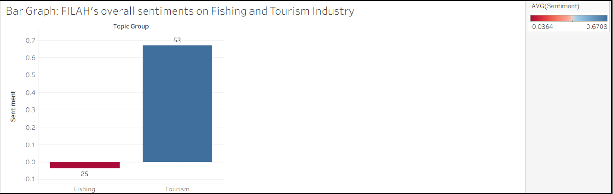{width="100%"}

This chart gives a high-level summary of how the FILAH dataset presents sentiment towards the two main topic groups: **Fishing** and **Tourism**.

A few things to note:
- Each bar represents the overall sentiment for one topic group.
- The number above the bar shows how many records or observations contribute to that group.
- The colour scale reflects sentiment:
  - **blue** indicates a more positive sentiment
  - **red/orange** indicates a more negative sentiment
- A bar above zero suggests a more positive overall view, while a bar below zero suggests a more negative one.

In this view, users can quickly compare whether FILAH’s dataset presents COOTEFOO as being more supportive of tourism or fishing overall.

:::

::: {.info-card}

#### FILAH sentiment across individual topics

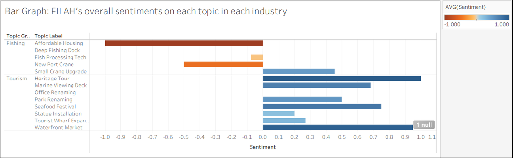{width="100%"}

This chart breaks the same idea down further by showing sentiment for each individual topic within the Fishing and Tourism groups.

How to read this chart:
- Topics are grouped into **Fishing** and **Tourism** on the left.
- Each horizontal bar shows the average sentiment for one topic.
- Bars extending further to the right indicate stronger positive sentiment.
- Bars extending to the left indicate negative sentiment.
- Darker colour intensity reflects a stronger sentiment value.

This chart is useful when users want to move beyond the overall summary and see which specific topics are driving the broader pattern.

:::

### TROUT charts

::: {.info-card}

#### TROUT overall sentiment by topic

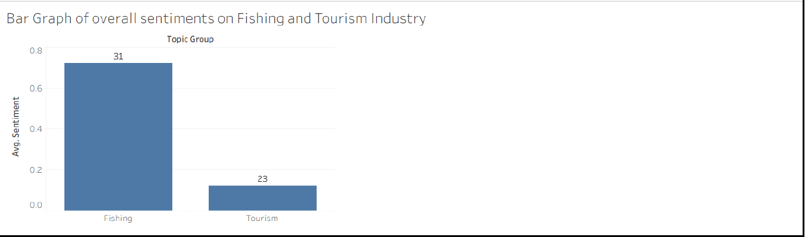{width="100%"}

This chart gives the overall sentiment pattern in the TROUT dataset for the two main topic groups: **Fishing** and **Tourism**.

Users can read it in the same way as the FILAH overview:
- each bar represents one topic group,
- the number above the bar shows the amount of supporting records,
- colour reflects whether sentiment is more positive or negative,
- and the bar height indicates the overall sentiment level.

This allows users to quickly compare how TROUT’s dataset frames COOTEFOO’s position across the two industries.

:::

::: {.info-card}

#### TROUT sentiment across individual topics

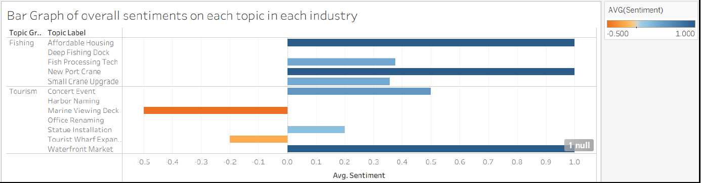{width="100%"}

This chart shows the sentiment for each specific topic captured in the TROUT dataset.

How to read this chart:
- Each bar corresponds to one topic under either Fishing or Tourism.
- The direction and length of the bar indicate whether sentiment is positive or negative, and by how much.
- Colour intensity reflects the strength of the sentiment.
- Looking across the bars makes it easier to see which individual topics are contributing most strongly to the overall trend.

This view is especially helpful when users want to compare topic-level differences rather than just the overall group average.

:::

::: {.takeaway-box}

**What to look out for**

When reading these charts, it helps to compare the **overall group summary** with the **topic-level breakdown**. The top-level chart shows the broad pattern, while the detailed chart shows which individual topics are actually driving that result. Hovering over the interactive version of the chart can also reveal additional details such as topic group, topic label, sentiment value, and record count.

:::

## 2. Activity Distribution Heatmaps

This visual shows how often each COOTEFOO member was involved in different activities under the **Fishing** and **Tourism** topic groups. The colour intensity reflects the number of times a member participated in a given activity, so darker cells indicate higher activity counts.

::: {.info-card}

### Main heatmap: how members allocate their time

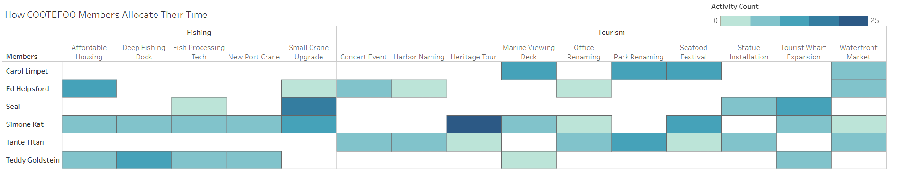{width="100%"}

This heatmap gives an overview of where members are spending their time across the two industries.

How to read it:
- Each **row** represents a COOTEFOO member.
- Each **column** represents a specific activity or topic.
- The chart is split into **Fishing** and **Tourism** sections.
- A darker cell means that the member appeared more frequently in that activity.
- Blank or very light cells indicate little or no recorded involvement.

This view is useful for spotting broad participation patterns. Users can quickly see which members are more active overall, and whether their activity is spread across both industries or concentrated in one area.

:::

::: {.card-grid}

::: {.info-card}
### Hovering over a cell

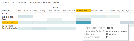{width="100%"}

When users hover over a cell, they can see more specific details such as:
- the topic group,
- the topic label,
- the COOTEFOO member,
- and the activity count for that cell.

This helps users move from the overall pattern to the exact value behind a specific square.
:::

::: {.info-card}
### Hovering over a topic or member

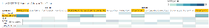{width="100%"}

Hovering over a **topic label** highlights all cells under that topic, making it easier to see which members were involved.

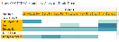{width="100%"}

Hovering over a **member name** highlights that person’s activity across the chart, which helps users follow one member’s participation pattern more clearly.
:::

:::

::: {.takeaway-box}

**What to look out for**

This heatmap is best used to identify **who is active**, **where that activity is concentrated**, and whether participation is spread evenly or clustered around particular members and topics. The main chart gives the overall structure, while the hover interactions make it easier to examine specific cells, rows, or columns in more detail.

:::

### Average sentiment heatmap

This companion heatmap shows the **average sentiment** expressed by each COOTEFOO member across different topics under **Fishing** and **Tourism**. While the previous heatmap focuses on how often members participated, this view focuses on whether their sentiment towards a topic was more positive, negative, or neutral.

::: {.info-card}

#### Main heatmap: members’ sentiment across topics

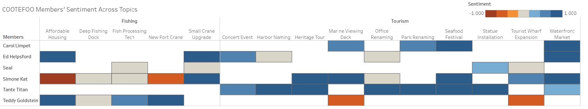{width="100%"}

This heatmap is useful for understanding not just where members were active, but how they appeared to feel about the topics they were involved in.

How to read it:
- Each **row** represents a COOTEFOO member.
- Each **column** represents a specific topic.
- The chart is divided into **Fishing** and **Tourism** sections.
- The colour scale reflects sentiment:
  - **blue** indicates more positive sentiment
  - **orange/red** indicates more negative sentiment
  - lighter or neutral tones indicate weaker or more balanced sentiment
- Darker shades represent stronger sentiment values in either direction.

This makes it easier to spot whether a member appears consistently supportive, consistently critical, or more mixed across the two topic groups.

:::

::: {.card-grid}

::: {.info-card}
#### Hovering over a cell

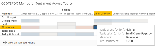{width="100%"}

When users hover over a cell, they can view details such as:
- the topic group,
- the topic label,
- the COOTEFOO member,
- and the average sentiment for that specific cell.

This helps users move from the broad colour pattern to the exact value behind a topic-member combination.
:::

::: {.info-card}
#### Hovering over a topic or member

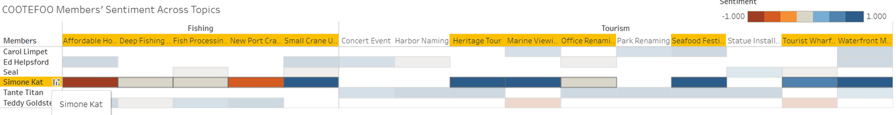{width="100%"}

Hovering over a **topic label** highlights the full column, making it easier to see which members expressed sentiment towards that topic.

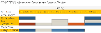{width="100%"}

Hovering over a **member name** highlights that member’s row, so users can follow how that individual’s sentiment varies across topics.
:::

:::

::: {.takeaway-box}

**What to look out for**

This heatmap is best used to compare **how different members feel about different topics**, rather than just how often they appeared. It is especially useful for spotting broad tendencies, such as whether a member seems more positive towards tourism-related topics, more negative towards fishing-related topics, or mixed across both.

:::

## 3. Topic Overview Across Meetings

This visual shows how different fishing- and tourism-related topics appeared across meetings, together with the average sentiment attached to each discussion detail. It is useful for understanding not just which topics were discussed, but also when they appeared and whether the sentiment around them was more positive, negative, or mixed.

::: {.info-card}

### Main chart: topic overview across meetings

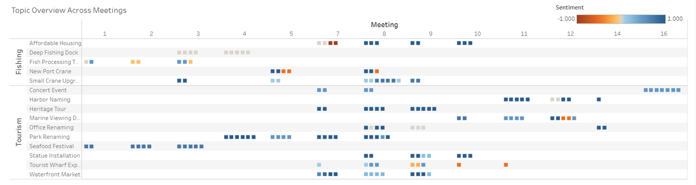{width="100%"}

This chart maps discussion activity across meetings.

How to read it:
- Each **row** represents a topic.
- Each **column** represents a meeting.
- Each **dot** represents one recorded discussion detail related to that topic in that meeting.
- If multiple dots appear in the same row and column, that means there were multiple details or discussion points recorded for that topic in that meeting.
- The colour of each dot reflects the average sentiment:
  - **blue** indicates more positive sentiment
  - **orange/red** indicates more negative sentiment
  - lighter tones indicate weaker or more neutral sentiment

This makes it possible to spot both the frequency of discussion and the emotional direction of those discussions at the same time.

:::

::: {.info-card}

### Hovering over a dot

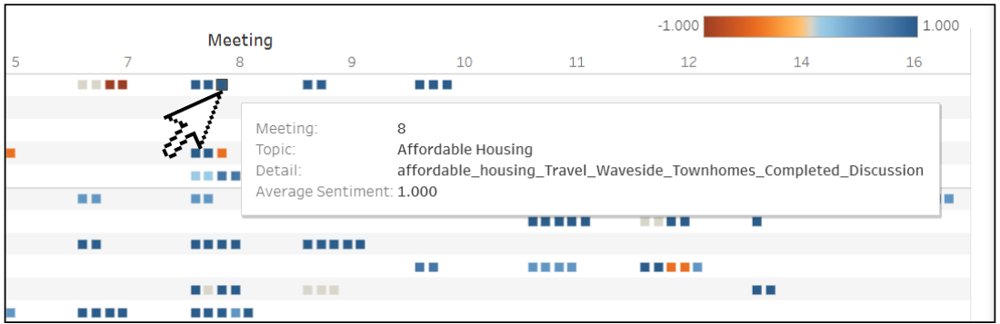{width="100%"}

When users hover over a dot, they can see:
- the meeting number,
- the topic,
- the specific discussion detail,
- and the average sentiment attached to that detail.

This helps users move beyond the overall visual pattern and inspect exactly what was being discussed at a particular point in time.

:::

::: {.takeaway-box}

**What to look out for**

This chart is most useful for identifying **when certain topics became active**, **which meetings were more discussion-heavy**, and whether the sentiment around a topic stayed consistent or changed over time. A row with many dots suggests repeated discussion, while a mix of blue and orange dots may indicate disagreement or changing sentiment across meetings.

:::

## 4. Individual Member Engagement and Sentiment Across Topics

This visual focuses on one COOTEFOO member at a time. It shows how that member’s discussions and sentiment were distributed across topics and meetings, allowing users to move from the broader meeting-level picture to a more individual-level view.

::: {.info-card}

### Main chart: individual member engagement across topics

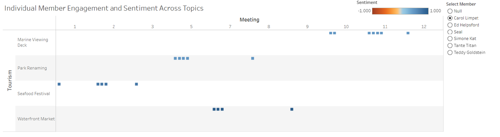{width="100%"}

This chart helps users understand how one selected member was involved in different topic discussions across meetings.

How to read it:
- Each **row** represents a topic.
- Each **column** represents a meeting.
- Each **dot** represents one discussion or plan related to that topic in that meeting for the selected member.
- The colour of the dot reflects sentiment:
  - **blue** indicates more positive sentiment
  - **orange/red** indicates more negative sentiment
- The chart updates based on which member is selected from the filter on the right.

This makes it easier to trace an individual member’s discussion pattern over time instead of looking at the committee as a whole.

:::

::: {.card-grid}

::: {.info-card}
### Hovering over a dot

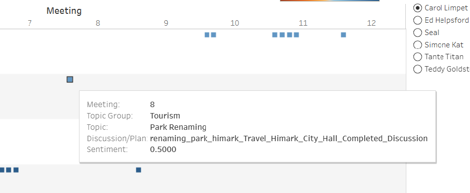{width="100%"}

When users hover over a dot, they can see more detailed information, including:
- the meeting number,
- the topic group,
- the topic,
- the discussion or plan,
- and the sentiment value.

This is useful when users want to inspect the exact record behind one point in the chart.
:::

::: {.info-card}
### Using the member filter

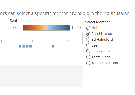{width="100%"}

The filter on the right allows users to select a specific COOTEFOO member. Once selected, the chart updates to show only that person’s engagement and sentiment across topics.

This feature is helpful when comparing members individually, especially when users want to see whether a person’s discussion pattern appears more concentrated in tourism-related topics, fishing-related topics, or both.
:::

:::

::: {.takeaway-box}

**What to look out for**

This visual is most useful when users want to understand **how one member behaves across meetings**, rather than how the entire committee behaves overall. By combining the member filter with the hover details, users can follow whether a member appears repeatedly in certain topics, whether their sentiment stays consistent, and whether their engagement is concentrated in one topic group or spread across both.

:::

## 5. Accused Members Comparison Charts

This pair of charts compares the members accused by TROUT and FILAH against the broader benchmark of sentiment and record coverage. It helps users see not only whether a member appears more positive or negative towards a topic group, but also how many records support that interpretation.

::: {.info-card}

### Main chart: comparing accused and non-accused members

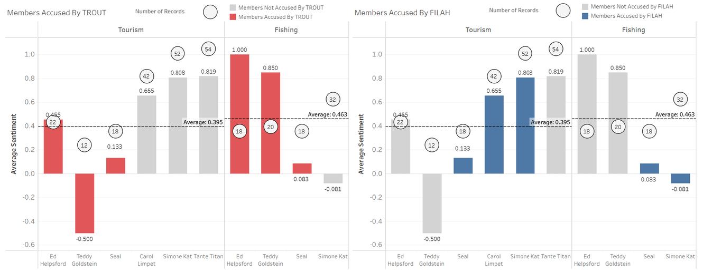{width="100%"}

These charts show the average sentiment of members across **Tourism** and **Fishing**, while also indicating whether they were accused by TROUT or FILAH.

How to read this visual:
- The **bars** represent the average sentiment for each member.
- The **height of the bar** shows whether sentiment is stronger or weaker.
- The chart is split into **Tourism** and **Fishing** sections.
- The **colour of the bar** shows accusation status:
  - **red** indicates members accused by TROUT
  - **blue** indicates members accused by FILAH
  - **grey** indicates members who were not accused
- The **circles above the bars** show the number of records contributing to that member’s score.
- The dashed horizontal line shows the group average, making it easier to compare each member against the broader pattern.

This visual is useful when users want to see whether a member’s accusation aligns with their observed sentiment, and whether that conclusion is supported by a large or small number of records.

:::

::: {.card-grid}

::: {.info-card}
### Hovering over the record-count circles

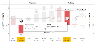{width="100%"}

When users hover over the circles, they can see the number of times a COOTEFOO member was involved in that topic group.

This is important because a member with a very strong-looking sentiment may still be based on only a small number of records, which makes the conclusion less stable.
:::

::: {.info-card}
### Hovering over the bars

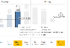{width="100%"}

When users hover over a bar, they can see more detail, such as:
- the topic group,
- the member,
- whether that member was accused,
- and the average sentiment value.

This makes it easier to compare whether the accusation matches the member’s broader sentiment pattern.
:::

:::

::: {.takeaway-box}

**What to look out for**

These charts are best used to compare **who was accused**, **how strongly their sentiment differs from the group average**, and **how much data supports that reading**. The bars show the sentiment pattern, while the circles help users judge whether that pattern is based on broad evidence or only a small number of records.

:::

## 6. Network Graph: Reconstructing the Full Picture

This visual brings everything together by showing how COOTEFOO members are connected to different topics through their discussions, activities, and plans. Instead of looking at topics or members separately, this graph shows how they are linked as a network.

::: {.info-card}

### Main chart: COOTEFOO network graph

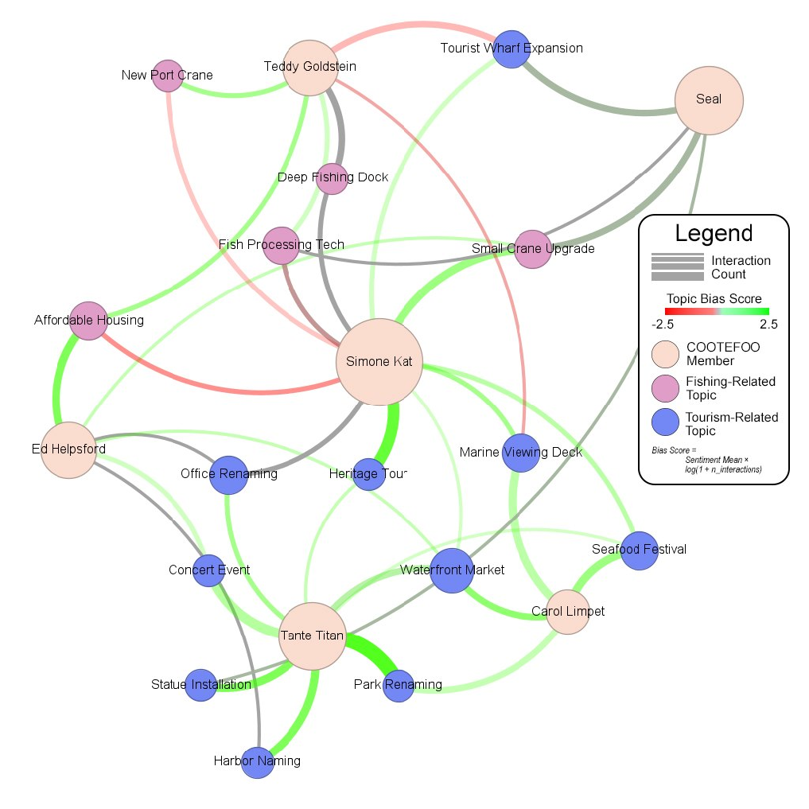{width="100%"}

This network graph connects members to the topics they were involved in.

How to read it:
- **Beige nodes** represent COOTEFOO members.
- **Blue nodes** represent tourism-related topics.
- **Pink nodes** represent fishing-related topics.
- Each **line (edge)** connects a member to a topic they interacted with.

This allows users to see how members are linked across different topics and whether their activity is concentrated in certain areas.

:::

::: {.card-grid}

::: {.info-card}
### Understanding the connections (edges)

- The **thickness of the line** shows how frequently a member interacted with a topic.  
  → Thicker lines mean more repeated discussions or involvement.

- The **colour of the line** reflects sentiment:
  - **Green** → more positive sentiment  
  - **Red** → more negative sentiment  
  - **Grey** → more neutral or mixed sentiment  

This helps users understand not just *what* was discussed, but also *how* members felt about those topics.
:::

::: {.info-card}
### Understanding the nodes

- **Node size (for members)** reflects how active they are overall.  
  → Larger nodes indicate members who participated in more discussions, activities, or plans.

- Topic nodes remain similar in size, but their **colour indicates category**:
  - Blue → Tourism  
  - Pink → Fishing  

This makes it easier to see which members are more connected to tourism or fishing topics at a glance.
:::

:::

::: {.takeaway-box}

**What to look out for**

This graph is most useful for identifying **overall patterns of engagement**. Users can look for clusters of connections, heavily connected members, and whether activity is concentrated around tourism or fishing topics. Thick green links suggest strong and consistent support, while mixed or thinner links may indicate weaker or more varied involvement.

:::
